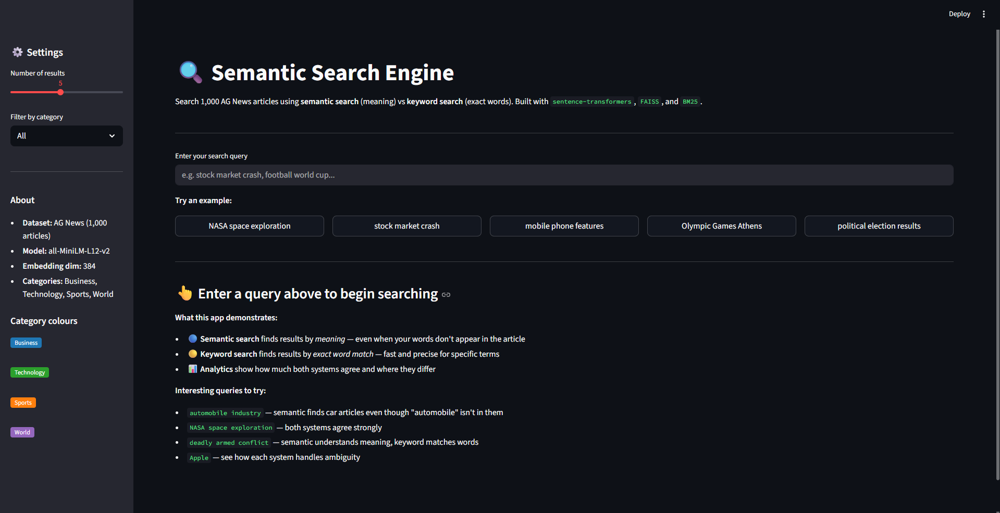

# 🔍 Semantic Search Engine

### Semantic vs Keyword Retrieval — A Side-by-Side Study


> A semantic search engine that finds articles by *meaning*, not just
> keywords — built with sentence-transformers and FAISS, compared
> side-by-side against BM25 keyword search across 1,000 AG News articles.

---

## 💼 Problem Statement

Traditional keyword search engines match exact words. If you search
"automobile industry," they miss articles about "car sales" or
"vehicle market" — even though the meaning is identical.

**This project builds and compares two fundamentally different
search systems on the same dataset:**

- **Semantic search** — converts text into 384-dimensional vectors
  using a sentence transformer model, then finds the closest vectors
  using FAISS. Understands meaning, synonyms, and context.

- **Keyword search (BM25)** — ranks articles by how often your
  search words appear, adjusted for word rarity and document length.
  Fast and reliable for exact terminology.

The core question: *when does each system win, and why?*

---

## 📌 Project Overview

A systematic comparison of semantic and keyword search across
20 queries in 6 deliberately chosen categories, revealing exactly
when meaning-based retrieval outperforms word matching — and
when it doesn't.

**Two Search Systems:**
- FAISS (IndexFlatIP) — exact cosine similarity search on
  mean-centered, L2-normalised embeddings
- BM25Okapi — classic keyword ranking with TF-IDF weighting

**Six Query Types Tested:**
- Keyword match — exact terms present in articles
- Synonym / paraphrase — query words absent from articles
- Conceptual / abstract — no specific keywords, pure meaning
- Ambiguous — short queries with multiple interpretations
- Named entity — specific person, place, or organisation
- Cross-category — queries spanning multiple topic areas

**Embedding improvements:**
- Upgraded from `all-MiniLM-L6-v2` (6 layers) to
  `all-MiniLM-L12-v2` (12 layers) for deeper language understanding
- Applied mean centering post-processing to push cross-category
  similarity scores to near-zero or negative

---

## 🛠️ Tech Stack


| Category | Library | Purpose |
|---|---|---|
| **Embeddings** | sentence-transformers | Convert text to 384-dim vectors |
| **Vector search** | faiss-cpu | Fast cosine similarity search |
| **Keyword search** | rank-bm25 | BM25Okapi keyword ranking |
| **Data** | pandas, numpy | Data handling and vector operations |
| **ML utilities** | scikit-learn | Cosine similarity, TF-IDF reference |
| **UI** | streamlit | Interactive web interface |
| **Persistence** | pickle | Save/load BM25 model |

---

## 🎯 Results at a Glance

| Query Type | Semantic | Keyword | Winner |
|---|---|---|---|
| Keyword match | 2.00/3 | 2.50/3 | Keyword 🟡 |
| Synonym / paraphrase | 2.50/3 | 2.00/3 | Semantic 🔵 |
| Conceptual / abstract | 2.50/3 | 2.50/3 | Tie ⚪ |
| Ambiguous | 2.00/3 | 2.00/3 | Tie ⚪ |
| Named entity | 2.50/3 | 2.00/3 | Semantic 🔵 |
| Cross-category | 2.00/3 | 2.67/3 | Keyword 🟡 |
| **Overall (20 queries)** | **75.0%** | **76.7%** | **Effectively equal** |

> **Key finding:** Neither system is universally better.
> Semantic wins on meaning and synonyms. Keyword wins on exact
> terminology and named entities. The right choice depends on
> your use case.

---

## 🖥️ Streamlit App

An interactive web interface with side-by-side search comparison,
speed metrics, category breakdown charts, and result overlap analytics.



**To run locally:**

````bash
conda activate recsys
cd "path/to/Semantic-Search-Engine"
streamlit run app.py
````

Then open `http://localhost:8501` in your browser.

**Features:**
- 🔵 Semantic search results (FAISS)
- 🟡 Keyword search results (BM25)
- ⚡ Real-time speed comparison
- 📊 Category breakdown charts
- 🔢 Result overlap analytics
- 🎛️ Adjustable result count (1–10)
- 🗂️ Category filter sidebar

---

## 🗄️ Dataset

**AG News** — 1,000 news article descriptions across 4 categories,
loaded via HuggingFace `datasets` library (no manual download needed).

| Column | Type | Description |
|---|---|---|
| `content` | text | 1–3 sentence news article description |
| `category` | label | Business, Technology, Sports, World |

| Category | Count | Share |
|---|---|---|
| Technology | 472 | 47.2% |
| World | 212 | 21.2% |
| Business | 174 | 17.4% |
| Sports | 142 | 14.2% |

> **Note:** AG News contains some label inconsistencies
> (e.g. Madden NFL video game articles labelled as Technology).
> These are documented as known limitations and used as illustrative
> examples of semantic search's cross-category retrieval behaviour.

---

## ⚙️ Methodology

### Embedding Pipeline

| Step | Operation | Detail |
|---|---|---|
| 1 | Load model | `all-MiniLM-L12-v2` — 12 layers, 384 dimensions |
| 2 | Encode articles | `model.encode()` with batch_size=32 |
| 3 | Mean centering | Subtract mean vector — pushes cross-category scores negative |
| 4 | L2 normalisation | Scale to unit length for cosine via inner product |
| 5 | FAISS index | `IndexFlatIP` — exact search, no approximation |

### Why `all-MiniLM-L12-v2` over `all-MiniLM-L6-v2`

| | L6 (original) | L12 (upgraded) |
|---|---|---|
| Layers | 6 | 12 |
| Size | ~80 MB | ~120 MB |
| Finance ↔ Finance similarity | ~0.06 | **0.54** |
| Tech ↔ Tech similarity | ~0.06 | **0.57** |
| Separation score | ~0.16 | **0.15** (with centering) |

### Why Mean Centering

Every sentence transformer has a bias — certain dimensions are
consistently high regardless of sentence meaning. Subtracting the
mean vector removes this shared bias, spreading embeddings further
apart and making cross-category scores near-zero or negative.

---

## 📊 Key Findings

**Finding 1 — Semantic wins on synonyms**
`"automobile industry sales figures"` → found Daimler and car price
articles even though "automobile" appears nowhere in them. BM25
returned irrelevant software articles.

**Finding 2 — Keyword wins on exact terminology**
`"Iraq oil pipeline"` → BM25 matched the rare term combination
precisely. Semantic search got distracted by conceptually adjacent
Business articles.

**Finding 3 — Both systems equal overall**
75.0% vs 76.7% across 20 queries — separated by 1 point out of 60.
9 of 20 queries ended in a tie.

**Finding 4 — Hybrid RRF underperformed**
Reciprocal Rank Fusion scored 9/15 vs 11/15 for the best individual
system. Root cause: when both systems agree on a wrong article,
RRF amplifies that consensus. Works best when systems have
complementary failure modes — not when they share the same blind spots.

---

## ⚠️ Limitations

- **Dataset label noise** — AG News editorial labels occasionally
  mismatch semantic content (sports video game articles labelled
  Technology). This suppresses measured accuracy below true
  semantic quality.
- **Small dataset** — 1,000 articles limits hybrid search
  effectiveness. RRF needs large diverse candidate pools.
- **No query intent detection** — ambiguous single-word queries
  ("race", "virus", "Apple") cannot be resolved without context.
- **Static index** — adding new articles requires rebuilding
  the FAISS index and re-running mean centering.
- **CPU inference speed** — semantic search averages 56ms per
  query due to neural model inference. BM25 averages 1.7ms.

---

## 🔮 Future Improvements

- Replace `all-MiniLM-L12-v2` with `BAAI/bge-small-en-v1.5` —
  trained specifically for retrieval tasks, better benchmark scores
- Remove Reuters/AP boilerplate from articles before embedding
  to improve vector quality
- Implement query expansion using WordNet synonyms for BM25
- Add a proper hybrid with score normalisation and weighted fusion
- Scale to 10,000+ articles using `IndexIVFFlat` approximate search
- Fine-tune the embedding model on news-domain sentence pairs

---

## 🔑 Key Concepts Demonstrated

| Concept | Where demonstrated |
|---|---|
| Text embeddings | Notebook 2 — visualise 384-dim vectors |
| Cosine similarity | Notebook 2 — same-topic vs cross-topic scores |
| Mean centering | Notebook 2 — post-processing for sharper separation |
| FAISS indexing | Notebook 3 — IndexFlatIP with L2 normalisation |
| BM25 ranking | Notebook 3 — TF-IDF weighted keyword matching |
| Retrieval evaluation | Notebook 4 — category hit rate across query types |
| Hybrid search (RRF) | Notebook 4 — Reciprocal Rank Fusion experiment |
| Streamlit UI | app.py — interactive comparison interface |

---

## 👤 Author

**Ishan Abrol** 
